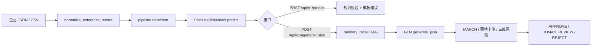

# 工矿企业风险预警智能体系统

[](https://www.python.org/downloads/)
[](https://fastapi.tiangolo.com)
[](https://react.dev)
[](https://vitejs.dev)
[]()

基于 Harness 工程化管控的工矿企业风险预警 LLM 智能体：Stacking 集成学习预测、GLM-5 决策工作流、三重校验风控、模型自动迭代 CI/CD。代码为 **Python monorepo 三包**（`mining_risk_common` / `mining_risk_serve` / `mining_risk_train`）+ 独立 React 前端。

## 快速开始

```bash
git clone <repository-url>
cd mining_risk_agent
docker compose up -d --build
open http://localhost:8501
```

| 服务 | 地址 | 说明 |
|------|------|------|
| React 前端 | http://localhost:8501 | 5 标签页 SCADA Dashboard（含数据可视化） |
| Swagger（同源） | http://localhost:8501/docs | 经 Nginx 代理后端 |
| FastAPI 直连 | http://localhost:8000/docs | 后端 API |
| 健康检查 | http://localhost:8000/health | 服务状态 |

内置 3 组场景 Mock，后端或 LLM 不可用时自动降级，演示可离线运行。生产部署详见 [DEPLOY.md](DEPLOY.md)。

## 目录

- [项目概览](#项目概览)
- [环境与依赖](#环境与依赖)
- [开发与部署](#开发与部署)
- [API 参考](#api-参考)
- [核心能力](#核心能力)
- [数据与模型流水线](#数据与模型流水线)
- [数据与模型流水线（长文档）](docs/PIPELINE.md)
- [软件架构](#软件架构)
- [前端演示](#前端演示)
- [测试](#测试)
- [常见问题](#常见问题)

---

## 项目概览

对齐《工矿企业风险预警智能体建设方案》与 Harness 研究方案，覆盖数据接入、风险预测、知识记忆、决策校验与模型迭代的完整链路。

| 模块 | 要点 |
|------|------|
| 数据与特征 | CSV/Excel/JSON 导入；二值/数值/枚举/文本/行业分类；干湿除尘、有限空间/危化品 OR、时间衰减、地理围栏、企业聚合、可信度系数 |
| 风险预测 | 7 基学习器 Stacking + 弹性网络元学习器；5 折严格时序 CV；SHAP / ROC / PR 等可视化 |
| Harness | AgentFS（`knowledge_base/`、`memory/` 沙箱）；P0–P3 短期记忆 + 长期记忆 RAG；6 大 Markdown 知识库 |
| NLP / RAG | BERT-BiLSTM-CRF 实体抽取；ChromaDB + SelfQuery + BGE-Reranker |
| 三重校验 | MARCH 孤立验证、蒙特卡洛置信度、三维风险评估、`ToolCallInterceptor`、RKS 驳回合成 |
| 决策工作流 | LangGraph 5 节点 DAG；MARCH 回环（≤3 次）；场景 chemical / metallurgy / dust |
| 模型迭代 | 监控触发 → 训练 → Git Flow → 回归/漂移 → 两级审批 → 试运行 → 灰度 |
| 前端 | React + ECharts；场景切换、SSE 节点流、知识库/记忆/CI/CD 演示 |

## 环境与依赖

### 克隆与虚拟环境

```bash
git clone <repository-url>
cd mining_risk_agent

uv venv .venv && source .venv/bin/activate   # 推荐 uv；亦可用 python -m venv
export MINING_PROJECT_ROOT="$(pwd)"
```

### 安装依赖

```bash
uv pip install -r requirements-serve.txt
uv pip install -e packages/mining_risk_common \
               -e packages/mining_risk_train \
               -e packages/mining_risk_serve

# 本地全量（训练 + RAG + 测试）
uv pip install -r requirements-full.txt
uv pip install -e "packages/mining_risk_train[ml]"
```

| 文件 | 用途 |
|------|------|
| `requirements-common.txt` | 共享包 |
| `requirements-serve.txt` | API + Agent |
| `requirements-train.txt` | 训练与迭代流水线 |
| `requirements-deploy.txt` | Docker API 默认 |
| `requirements-deploy-rag.txt` | Docker + RAG |
| `requirements-serve-rag.txt` | 本地 API + RAG |
| `requirements-full.txt` | 研发全量 |

### RAG（可选）

默认在 `config.yaml` 开启（`harness.memory.long_term.rag.enabled: true`）。

```bash
uv pip install -r requirements-serve-rag.txt   # 或 requirements-full.txt

python scripts/init_knowledge_base.py --data-dir datasets/raw/public
python scripts/rebuild_rag_index.py --clear --embedding-backend fallback   # 离线/CI
# python scripts/rebuild_rag_index.py --clear --embedding-backend auto     # 生产 BGE
```

| 嵌入后端 | 维度 | 说明 |
|----------|------|------|
| `fallback` | 384 | 无需下载模型；`rebuild` 与运行时须一致 |
| `BAAI/bge-large-zh-v1.5` | 1024 | 首次从 Hugging Face 下载；缓存默认 `~/.cache/huggingface` |

切换嵌入后端须 `--clear` 重建索引，否则会出现维度不匹配错误。环境变量见 `.env.example`（`RAG_EMBEDDING_BACKEND`、`HF_HOME` 等）。

### 训练数据

将公开数据解压至 `datasets/raw/public/`，宽表放入 `datasets/interim/merged/`。路径可在 `config.yaml` 的 `data.raw_data_path` 修改，详见 [datasets/README.md](datasets/README.md)。

## 开发与部署

### Docker（推荐）

```bash
cp .env.example .env    # 可选：LLM、MRA_ADMIN_TOKEN 等
docker compose up -d --build
```

| 服务 | 镜像 | 端口 | 说明 |
|------|------|------|------|
| `api` | `mining-risk-agent-api` | 8000 | FastAPI + 三包 editable |
| `frontend` | `mining-risk-agent-frontend` | 8501→80 | Nginx 反代 `/api`、`/health`、`/docs`（关闭 buffering 以支持 SSE） |

开发时 `./packages` 挂载进容器，改 Python 源码后重启 `api` 即可。Nginx 配置见 `frontend/nginx.conf`。

### 本地开发

```bash
# API
bash scripts/run_api.sh --reload          # http://localhost:8000/docs

# 前端
cd frontend && npm install && npm run dev # http://localhost:5173，/api 代理到 :8000

# 训练
python scripts/train_model.py
python scripts/train_ner.py --data datasets/processed/ner_train.json \
  --output artifacts/models/ner_model.pt --epochs 10
python -m mining_risk_train.visualization

# 模型迭代
python -m mining_risk_train.iteration.pipeline
python -m mining_risk_train.iteration.regression_test \
  --old artifacts/models/stacking_risk_v1.pkl \
  --new artifacts/models/stacking_risk_v2.pkl \
  --test datasets/processed/test.csv
```

## API 参考

完整契约以 Swagger 为准：`http://localhost:8000/docs` 或 `http://localhost:8501/docs`。

### 核心接口

| 接口 | 方法 | 说明 |
|------|------|------|
| `/health` | GET | 健康检查 |
| `/api/v1/data/upload` | POST | 单文件上传 |
| `/api/v1/data/upload/batch` | POST | 批量上传 |
| `/api/v1/knowledge/list` | GET | 知识库列表 |
| `/api/v1/knowledge/read/{filename}` | GET | 读取知识库 |
| `/api/v1/knowledge/write` | POST | 写入知识库 |
| `/api/v1/agent/decision` | POST | 完整决策工作流 |
| `/api/v1/agent/decision/stream` | POST | SSE 节点流 |
| `/api/v1/agent/decision/records` | GET | 历史决策列表 |
| `/api/v1/agent/decision/records/{record_id}` | GET | 单条决策详情 |
| `/api/v1/agent/scenario/{scenario_id}` | POST | 切换场景 |
| `/api/v1/iteration/trigger` | POST | 触发迭代流水线 |
| `/api/v1/iteration/status` | GET | 迭代状态 |
| `/api/v1/iteration/approve` | POST | 两级审批 |
| `/api/v1/iteration/canary` | POST | 灰度比例 |
| `/api/v1/visualization/enterprise-map/markers` | GET | 企业风险地图点位（经纬度 + 预测等级 + 跟踪状态） |

敏感操作需请求头 `X-Admin-Token`（`MRA_ADMIN_TOKEN`）。本地可临时设 `MRA_ALLOW_UNAUTHENTICATED_ADMIN=true`；生产建议 `MRA_ENABLE_MOCK_FALLBACK=false`。

### 决策示例

```bash
curl -X POST http://localhost:8000/api/v1/agent/decision \
  -H "Content-Type: application/json" \
  -d '{"enterprise_id":"ENT-001","data":{"管理类别":1003,"是否发生事故":0}}'
```

响应含 `predicted_level`、`government_intervention`、`enterprise_control`、`march_result`、`monte_carlo_result`、`three_d_risk` 等字段。流式版：`POST /api/v1/agent/decision/stream`，返回 `text/event-stream`。

**场景阈值**：chemical 更严（置信度 0.90、风险分 2.2）；metallurgy / dust 为 0.85 / 2.5。

## 核心能力

### 风险预测（Stacking）

7 个基学习器（LR、XGBoost、LightGBM、CatBoost、RF、MLP、1D-CNN）输出 28 维 OOF 概率，元学习器为弹性网络多项逻辑回归。`StrictTimeSeriesSplit(n_splits=5)` 保证训练时间严格早于测试。

### NLP 与 RAG

- **NER**：BERT-Base-Chinese + BiLSTM + CRF；标签含高风险设备、风险属性、动作、法规条款；无模型时回退规则词典。
- **检索**：Markdown 按标题切分（≤300 字）；ChromaDB + 元数据 SelfQuery；默认嵌入 `BAAI/bge-large-zh-v1.5`。
- **精排**：`BAAI/bge-reranker-large` CrossEncoder。
- **知识库构建**：爬虫抓取公开法规 + `scripts/init_knowledge_base.py` 融合企业 CSV 生成 6 大知识库。

### 三重校验

1. **MARCH**：合规 → 工况逻辑 → 处置可行性；Checker 仅见 `atomic_propositions`。
2. **蒙特卡洛**：20 次采样，置信度低于 0.85 → `HUMAN_REVIEW`。
3. **三维风险**：后果严重度 / 利益相关性 / 执行不可逆性加权；超阈阻断。
4. **RKS**：驳回后提取四元组写入案例库与经验摘要，并 Git 快照。

### 决策工作流

```
data_ingestion → risk_assessment → memory_recall → decision_generation → result_push
```

`decision_generation` 内：Jinja2 Prompt → GLM-5 JSON → MARCH 回环 → 蒙特卡洛 → 三维路由。LLM 通过 `llm.provider` / `LLM_PROVIDER` 配置 OpenAI 兼容端点。

### 模型迭代 CI/CD

```
监控触发 → 训练 → Git Flow → 回归测试 → Drift → 两级审批 → 试运行(24h) → 灰度(0.1→0.5→1.0)
```

| 触发条件 | 说明 |
|----------|------|
| 样本超过 5000 | `SAMPLE_THRESHOLD_EXCEEDED` |
| 近期 F1 低于 0.85 | `PERFORMANCE_DEGRADED` |

审批状态：`PENDING_REVIEW → SECURITY_APPROVED → TECH_APPROVED → STAGING → PRODUCTION`。GitHub Actions（`.github/workflows/ci.yml`）含 flake8、black、pytest、回归对比。

**Demo Replay**：默认从 `datasets/demo/*.json` 回放迭代批次（`normal_batch`、`risk_spike_retrain`、`f1_drop_retrain` 等）。接口：`GET /api/v1/iteration/demo-batches`、`POST .../load`。

### 特征工程

| 类型 | 处理 |
|------|------|
| 二值/数值/枚举/文本/行业 | 0/1 映射、分位截断+对数+归一化、有序编码、完整性+高危词、行业风险系数 |
| 特殊逻辑 | 干湿除尘比、有限空间/危化品 OR、时间衰减、地理围栏、企业聚合、检查来源可信度 |

## 数据与模型流水线

本节说明**离线训练**、**在线推理**两条路径，以及 **Stacking 与 GLM 的分工**（简明版）。

**完整长文档**：[docs/PIPELINE.md](docs/PIPELINE.md)（逐字段字典、中英映射、GLM/Harness 细节、排障与扩展清单）。字段配置权威来源仍为 `config.yaml` → `features`；数据目录见 [datasets/README.md](datasets/README.md)。

### 职责划分（先看这张表）

| 环节 | 实现 | 是否用 GLM |
|------|------|------------|
| 特征工程 | `FeatureEngineeringPipeline`（sklearn） | 否 |
| 风险等级（蓝/黄/橙/红） | `StackingRiskModel`（本地 pkl） | 否 |
| 政企处置 JSON | `decision_generation` 节点 | **是** |
| 记忆召回 | ChromaDB + BGE 嵌入 | 否 |
| MARCH / 蒙特卡洛 / 三维风险 | Harness 规则与采样 | 否 |

**结论**：GLM 只负责根据 ML 预测结果与上下文生成结构化处置方案，**不参与训练，也不决定风险等级**。

### 离线训练流程

命令：`python scripts/train_model.py`（实现：`packages/mining_risk_train/.../train.py`）。

```
预合并宽表 new_已清洗.xlsx
  → 按 report_time 时序排序
  → 标签 new_level（A/B/C/D）映射为 0–3，无效行剔除
  → FeatureEngineeringPipeline.fit_transform → 保存 preprocessing_pipeline.pkl
  → 时序划分 train 70% / val 20% / test 10%（train+val 合并后 fit）
  → StackingRiskModel.fit（内部 5 折时序 CV 生成 28 维 OOF 元特征）
  → 评估 test 集 → 保存 stacking_risk_v1_stable.pkl
```

| 项 | 说明 |
|----|------|
| 训练数据 | 默认 `datasets/interim/merged/new_已清洗.xlsx`（`config.yaml` → `data.merged_data_path`） |
| 目标列 | `new_level`：A→0、B→1、C→2、D→3；**不进入**特征 pipeline |
| 输出等级名 | `config.yaml` → `model.risk_levels`：`["蓝","黄","橙","红"]`，与 0–3 一一对应 |
| 产物配对 | `artifacts/pipelines/preprocessing_pipeline.pkl` 与 `artifacts/models/stacking_risk_v1_stable.pkl` 须为同一次训练产出 |

公开原始表（`datasets/raw/public/`）主键往往无法可靠 join，日常训练以预合并宽表为准；多表合并逻辑见 `DataLoader.load_and_merge_data()`。

### 字段如何处理

**配置**：`config.yaml` → `features`（二值 / 数值 / 枚举 / 行业 / 特殊逻辑列名）。

**API 与演示 CSV**：中文表头经 `field_normalizer.normalize_enterprise_record()` 映射为英文训练列（见 `packages/mining_risk_common/.../field_normalizer.py` 的 `FIELD_ALIASES`）；按场景 `chemical` / `metallurgy` / `dust` 补 `SCENARIO_DEFAULTS`；缺列按类型填默认后再进 pipeline。

| 类型 | 示例列 | 变换 |
|------|--------|------|
| 主键 | `enterprise_id`, `enterprise_name` | 丢弃，不参与建模 |
| 二值 | `risk_accident_flag`, `is_explosive_dust` 等 | 统一 0/1；缺失→0 |
| 数值 | `staff_num`, `trouble_*`, `risk_*_count` 等 | 99 分位截断 → 填缺失 → log1p → MinMax |
| 枚举 | `safety_build`, `business_status` 等 | 有序风险编码 [0,1] |
| 行业 | `indus_type_*`, `supervision_large` | 行业风险系数 |
| 特殊逻辑 | 见 `features.special_features` | 干湿除尘比、有限空间/危化 OR、时间衰减、地理围栏、企业聚合、数据来源可信度 |

演示数据 `datasets/demo/csv/mock_enterprises_dust.csv` 等使用中文列名；未列入 `config.yaml` 的列（如部分粉尘场景专有字段）标准化后不会进入训练特征。

### 在线推理：两条 API 路径



| 路径 | 接口 | GLM | 典型输出 |
|------|------|-----|----------|
| 纯预测 | `POST /api/v1/predict` | 否 | `predicted_level`、概率、SHAP、`ValidationPipeline` 结果 |
| 完整决策 | `POST /api/v1/agent/decision` | 是 | 上述 + `government_intervention` / `enterprise_control` + `final_status` |

LangGraph 五节点：`data_ingestion` → `risk_assessment` → `memory_recall` → `decision_generation` → `result_push`（`packages/mining_risk_serve/.../agent/workflow.py`）。

### GLM 在输出中的作用

- **客户端**：`packages/mining_risk_serve/.../llm/glm5_client.py`（OpenAI 兼容，默认智谱 `https://open.bigmodel.cn/api/paas/v4/`）。
- **配置**：`config.yaml` → `llm.providers.glm5`；环境变量 `GLM5_API_KEY`、`LLM_GLM5_MODEL`、`LLM_PROVIDER`（见 `.env.example`）。
- **调用时机**：仅 `decision_generation` 内 `generate_json()`，`response_format: json_object`。
- **Prompt 输入**：场景模板 `prompts/decision_v1_{chemical|metallurgy|dust}.txt`（Jinja2），注入 `predicted_level`、概率分布、SHAP、RAG `memory_context`、场景物理常识片段。
- **期望 JSON**：`risk_level_and_attribution`、`government_intervention`、`enterprise_control`。
- **之后（非 GLM）**：MARCH 不通过时带修正反馈最多重试 3 次；再经蒙特卡洛（20 次）与三维风险评分得到 `final_status`。

后端或 LLM 不可用时，可设 `MRA_ENABLE_MOCK_FALLBACK=true` 走 Mock 决策（见 [常见问题](#常见问题)）。

### 关键源码索引

| 主题 | 路径 |
|------|------|
| 训练入口 | `scripts/train_model.py` → `mining_risk_train/train.py` |
| 特征工程 | `mining_risk_common/dataplane/preprocessor.py` |
| 字段标准化 | `mining_risk_common/dataplane/field_normalizer.py` |
| Stacking 模型 | `mining_risk_common/model/stacking.py` |
| 预测服务 | `mining_risk_serve/api/services/prediction_service.py` |
| 决策工作流 | `mining_risk_serve/agent/workflow.py` |
| GLM 客户端 | `mining_risk_serve/llm/glm5_client.py` |

## 软件架构

```
frontend/ ──HTTP──► mining_risk_serve (api / agent / harness / llm)
                         ├── mining_risk_common (dataplane / model / demo)
                         └── mining_risk_train (train / iteration / viz)
```

| 包 | 职责 |
|----|------|
| `mining_risk_common` | 特征工程、Stacking 核心、配置、演示 Mock |
| `mining_risk_serve` | FastAPI、LangGraph 工作流、Harness、运行时迭代 |
| `mining_risk_train` | 离线训练、回归/漂移、可视化 |
| `mining_risk_compat` | 旧 `mining_risk.*` 重导出（过渡期，带 DeprecationWarning） |

后端分层：Router → Service → Protocol → 领域模块。新接口推荐 `ApiResponse<T>` 信封（`schemas/common.py`）；历史预测/决策接口保持直出业务模型以兼容前端。

**导入迁移**：

| 旧 | 新 |
|----|-----|
| `mining_risk.api.main` | `mining_risk_serve.api.main` |
| `mining_risk.harness.*` | `mining_risk_serve.harness.*` |
| `mining_risk.dataplane.*` | `mining_risk_common.dataplane.*` |
| `mining_risk.model.stacking` | `mining_risk_common.model.stacking` |
| `mining_risk.iteration.pipeline` | `mining_risk_train.iteration.pipeline` |
| `mining_risk.iteration.monitor` | `mining_risk_serve.iteration.monitor` |

```
mining_risk_agent/
├── packages/          # common / serve / train / compat
├── frontend/          # React SPA
├── datasets/          # raw / interim / demo / processed
├── artifacts/         # 模型与 pipeline
├── knowledge_base/    # Markdown 知识库
├── var/               # chroma、decisions 等运行时
├── scripts/           # 训练、索引、知识库初始化
├── tests/
├── config.yaml
├── docker-compose.yml
└── DEPLOY.md
```

## 前端演示

访问 http://localhost:8501（Docker）或 http://localhost:5173（`npm run dev`）。

| 标签页 | 功能 |
|--------|------|
| 企业风险预测 | 场景切换、上传/模拟数据、风险仪表盘、SHAP、决策卡片、SSE 日志 |
| 数据可视化 | 预警趋势、相关性热力图、企业统计分布（读取 `datasets/raw/public`） |
| 风险地图 | OpenStreetMap 企业落点、模型风险等级着色、搜索与已跟踪企业侧栏 |
| 企业多维画像 | `datasets/enterprise_db` 企业档案、分类统计、详情面板 |
| 知识库与记忆 | 6 大知识库预览、P0–P3 短期记忆、长期 RAG 召回 |
| 模型迭代 CI/CD | 版本时间线、审批流、灰度进度、模拟迭代动画 |
| 系统配置 | LLM 连通性、场景参数、Swagger 链接 |

**Mock 降级**：后端 `prediction_service` 返回 `mock=true`；前端 `demoData.ts` 在 `/api` 不可达时兜底。三场景 Mock 差异见 chemical（`HUMAN_REVIEW`）、metallurgy（`APPROVE`）、dust（`REJECT`）。

**路演前检查**（1920×1080 全屏）：

1. 各标签页切换无报错  
2. 模拟数据 → 执行预测，5 秒内出结果  
3. 切换 chemical / metallurgy / dust，阈值与 `scenario_id` 变化  
4. 知识库列表与记忆清理/RAG 召回  
5. 触发模拟迭代动画  
6. 停止 `api` 容器后前端仍可预测（验证 Mock）

截图可置于 `assets/screenshots/`（`tab1_risk_prediction.png` 等）。

## 测试

```bash
export MINING_PROJECT_ROOT="$(pwd)"
export GLM5_API_KEY=test-key

uv pip install -r requirements-full.txt pytest pytest-asyncio
uv pip install -e packages/mining_risk_common -e packages/mining_risk_train -e packages/mining_risk_serve

pytest tests/ -v --ignore=tests/test_nlp_pipeline.py --ignore=tests/test_crawler.py
```

按模块单独运行：`test_agentfs.py`、`test_harness.py`、`test_memory.py`、`test_validation.py`、`test_agent_workflow.py`、`test_iteration.py` 等。

## 常见问题

**无网络 / 无 API Key？**  
`docker compose up` 或仅 `cd frontend && npm run dev` 即可；决策走 Mock，无需训练数据。

**如何切换场景？**  
侧边栏选择 chemical / metallurgy / dust，或 `POST /api/v1/agent/scenario/{id}`。

**决策 JSON 保存在哪？**  
默认 `var/decisions`，可用 `MINING_DECISION_OUTPUT_DIR` 覆盖（须在 `var/` 下）。历史记录：`GET /api/v1/agent/decision/records`。

**批量决策？**  
前端上传 CSV/Excel，后端创建任务、默认并发 3、单批最多 500 行，输出至 `batches/<job_id>/`。

**`HUMAN_REVIEW` 与审批？**  
落盘后自动入审批队列；可在「审批管理」处理，或 `POST /api/v1/agent/decision/approvals/sync-from-disk` 补录。

**知识库乱码？**  
文件为 UTF-8；Windows 请将终端/编辑器编码设为 UTF-8。

## 许可证

本项目仅供研究与学习使用。
