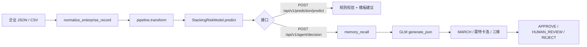

# 工矿企业风险预警智能体系统

[Python 3.10+](https://www.python.org/downloads/)
[FastAPI](https://fastapi.tiangolo.com)
[React](https://react.dev)
[Vite](https://vitejs.dev)
[License]()

基于 Harness 工程化管控的工矿企业风险预警智能体：**Stacking 本地模型**产出风险等级（蓝/黄/橙/红），**GLM（OpenAI 兼容）**仅生成结构化处置文案，MARCH / 蒙特卡洛 / 三维风险做规则校验。代码为 Python monorepo（`mining_risk_common` / `mining_risk_serve` / `mining_risk_train`）+ React 前端。

> **说明**：本仓库是「方案级全链路参考实现 + 可离线演示」，功能面大于最小上线产品。若只关心预测 API，见下文 [功能范围](#功能范围) 与 [最小部署](#最小部署)。

---

## 文档索引


| 文档                                       | 内容                          |
| ---------------------------------------- | --------------------------- |
| [CLAUDE.md](CLAUDE.md)                   | Agent / 协作者工作指南（改代码流程、路径约定） |
| [DEPLOY.md](DEPLOY.md)                   | 生产部署                        |
| [docs/PIPELINE.md](docs/PIPELINE.md)     | 训练/推理流水线、字段字典、排障            |
| [datasets/README.md](datasets/README.md) | 数据目录约定                      |
| [frontend/README.md](frontend/README.md) | 前端结构与本地开发                   |


---

## 快速开始

```bash
git clone <repository-url>
cd mining_risk_agent
docker compose up -d --build
open http://localhost:8501
```


| 服务          | 地址                                                           | 说明                    |
| ----------- | ------------------------------------------------------------ | --------------------- |
| React 前端    | [http://localhost:8501](http://localhost:8501)               | 7 标签页 SCADA Dashboard |
| Swagger（同源） | [http://localhost:8501/docs](http://localhost:8501/docs)     | Nginx 反代后端            |
| FastAPI 直连  | [http://localhost:8000/docs](http://localhost:8000/docs)     | 后端 API                |
| 健康检查        | [http://localhost:8000/health](http://localhost:8000/health) | 服务状态                  |


内置 3 组场景 Mock；后端或 LLM 不可用时自动降级，演示可离线运行。

仅启动后端（不跑 Docker）：见 [后端部署（本地）](#后端部署本地)。

---

## 功能范围


| 层级          | 能力                                                   | 典型用途         |
| ----------- | ---------------------------------------------------- | ------------ |
| **核心**      | 特征工程 + Stacking 预测、`POST /api/v1/prediction/predict` | 监管预警、批量评分    |
| **智能体**     | LangGraph 五节点 + GLM 处置 JSON + 决策落盘                   | 政企协同文案、审计追溯  |
| **Harness** | MARCH / 蒙特卡洛 / 三维风险、P0–P3 记忆、六库 RAG                  | 合规校验、经验召回    |
| **演示增强**    | 模型迭代 CI/CD 回放、7 Tab 前端、企业地图/画像                       | 答辩、方案对标、离线路演 |


**职责边界（必读）**：风险等级**仅**由 Stacking + `preprocessing_pipeline.pkl` 决定；GLM **不参与**训练与等级判定。详见 [数据与模型流水线](#数据与模型流水线)。

---

## 项目概览


| 模块        | 要点                                                        |
| --------- | --------------------------------------------------------- |
| 数据与特征     | CSV/Excel/JSON；二值/数值/枚举/行业；干湿除尘、有限空间/危化 OR、时间衰减等          |
| 风险预测      | **5** 基学习器 Stacking（见 `config.yaml`）+ 弹性网络元学习器；5 折严格时序 CV |
| Harness   | AgentFS；P0–P3 短期记忆 + 长期 RAG；6 份 Markdown 知识库              |
| NLP / RAG | BERT-BiLSTM-CRF（可选）；ChromaDB + BGE 嵌入 / Reranker          |
| 三重校验      | MARCH、蒙特卡洛、三维风险、RKS 驳回沉淀                                  |
| 决策工作流     | LangGraph；场景 `chemical` / `metallurgy` / `dust`           |
| 模型迭代      | 监控 → 训练 → 回归/漂移 → 两级审批 → 灰度；`datasets/demo/*.json` 可回放    |
| 前端        | React + ECharts + Leaflet；SSE 决策流、风险地图、企业画像               |


当前 Stacking 基学习器（`config.yaml` → `model.stacking.base_learners`）：**LR、XGBoost、LightGBM、CatBoost、Random Forest**。默认产物 `stacking_risk_v1_stable.pkl`（树模型组合，避免 Keras 反序列化问题）。OOF 元特征维度 = 基学习器数 × 4 类 = **20 维**。

---

## 环境与依赖

### 克隆与虚拟环境

```bash
git clone <repository-url>
cd mining_risk_agent

uv venv .venv && source .venv/bin/activate
export MINING_PROJECT_ROOT="$(pwd)"
```

### 安装依赖

```bash
uv pip install -r requirements-serve.txt
uv pip install -e packages/mining_risk_common \
               -e packages/mining_risk_train \
               -e packages/mining_risk_serve

# 训练 + RAG + 全量测试
uv pip install -r requirements-full.txt
uv pip install -e "packages/mining_risk_train[ml]"
```


| 文件                            | 用途                     |
| ----------------------------- | ---------------------- |
| `requirements-common.txt`     | 共享包                    |
| `requirements-serve.txt`      | API + Agent（无 RAG 重依赖） |
| `requirements-serve-rag.txt`  | 本地 API + RAG           |
| `requirements-train.txt`      | 训练与迭代                  |
| `requirements-deploy.txt`     | Docker API 默认          |
| `requirements-deploy-rag.txt` | Docker + RAG           |
| `requirements-full.txt`       | 研发全量                   |


### RAG（可选）

默认在 `config.yaml` 开启（`harness.memory.long_term.rag.enabled: true`）。仅跑预测可关闭 RAG 或使用 `requirements-serve.txt` 部署。

```bash
uv pip install -r requirements-serve-rag.txt

python scripts/rebuild_rag_index.py --clear --embedding-backend fallback   # 离线/CI
# python scripts/rebuild_rag_index.py --clear --embedding-backend auto     # 生产 BGE
```


| 嵌入后端                     | 维度   | 说明                     |
| ------------------------ | ---- | ---------------------- |
| `fallback`               | 384  | 无需下载；`rebuild` 与运行时须一致 |
| `BAAI/bge-large-zh-v1.5` | 1024 | 首次从 Hugging Face 下载    |


切换嵌入后端须 `--clear` 重建索引。环境变量见 `.env.example`。

### 训练数据

公开数据 → `datasets/raw/public/`；预合并宽表 → `datasets/interim/merged/new_已清洗.xlsx`。详见 [datasets/README.md](datasets/README.md)。

---

## 开发与部署

### 后端部署（本地）

前置：完成上文 [环境与依赖](#环境与依赖) 中的虚拟环境与 `uv pip install`（`requirements-serve.txt` + 三包 editable）。**必须**设置仓库根：

```bash
export MINING_PROJECT_ROOT="$(pwd)"
```

启动 API（开发态推荐封装脚本，仅监视源码目录，避免 `.venv` / `var` 触发无限重载）：

```bash
bash scripts/run_api.sh --reload
# 等价：python run_api.py --reload（参数会传给 uvicorn）
# 若手写 uvicorn --reload，请参照 scripts/run_api.sh 的 --reload-dir / --reload-exclude
```

| 项 | 说明 |
| --- | --- |
| API 文档 | http://localhost:8000/docs |
| 健康检查 | http://localhost:8000/health |
| 入口模块 | `mining_risk_serve.api.main:app` |
| 模型产物 | `artifacts/pipelines/preprocessing_pipeline.pkl`、`artifacts/models/stacking_risk_v1_stable.pkl`（须同次训练） |
| 决策落盘 | 默认 `var/decisions/`（`MINING_DECISION_OUTPUT_DIR`） |
| RAG | 需 `requirements-serve-rag.txt` 并执行 `scripts/rebuild_rag_index.py`；仅预测可关 RAG 或跳过索引 |

常用环境变量（完整表见 `.env.example`）：

| 变量 | 用途 |
| --- | --- |
| `GLM5_API_KEY` / `LLM_*` | GLM 决策文案（OpenAI 兼容） |
| `MRA_ENABLE_MOCK_FALLBACK` | 后端故障时 Mock 降级；**生产建议 `false`** |
| `MRA_ADMIN_TOKEN` | 管理接口 `X-Admin-Token` |
| `MRA_CORS_ORIGINS` | 允许的前端 Origin（逗号分隔） |
| `RAG_EMBEDDING_BACKEND` | RAG 嵌入后端，须与 `rebuild_rag_index.py` 一致 |

验证：

```bash
curl http://localhost:8000/health
curl -X POST http://localhost:8000/api/v1/prediction/predict \
  -H "Content-Type: application/json" \
  -d '{"data":{"管理类别":1003,"是否发生事故":0}}'
```

离线训练（更新 pkl 后重启 API）：

```bash
python scripts/train_model.py
```

### Docker 全栈（推荐）

前后端各自独立镜像，一键启动：

```bash
cp .env.example .env   # 可选：LLM、MRA_ADMIN_TOKEN、API_REQUIREMENTS_FILE 等
docker compose up -d --build
```

| 服务 | 镜像 | 端口 | 说明 |
| --- | --- | --- | --- |
| `api` | `mining-risk-agent-api:latest` | `127.0.0.1:8000` | FastAPI + Uvicorn；默认 `API_REQUIREMENTS_FILE=requirements-deploy.txt` |
| `frontend` | `mining-risk-agent-frontend:latest` | `8501→80` | React SPA + Nginx 反代 `/api`、`/health`、`/docs`（SSE 已关 buffering） |

访问：前端 http://localhost:8501 ；Swagger 同源 http://localhost:8501/docs 或直连 http://localhost:8000/docs 。

`api` 容器挂载：`datasets/`、`artifacts/`、`var/`、`knowledge_base/`、`config.yaml` 等（详见 [DEPLOY.md](DEPLOY.md)）。需要 RAG 时将 `.env` 中 `API_REQUIREMENTS_FILE` 改为 `requirements-deploy-rag.txt` 并重建索引。

### 前端开发（本地）

```bash
cd frontend && npm install && npm run dev   # http://localhost:5173，/api 代理 :8000
```

可用 `VITE_DEV_API_TARGET=http://其他主机:8000 npm run dev` 指向远程后端。结构说明见 [frontend/README.md](frontend/README.md)。

### 生产部署

TLS、反向代理、CORS、数据持久化与故障排查见 **[DEPLOY.md](DEPLOY.md)**。

### 最小部署

仅需**风险预测**时：

1. `requirements-serve.txt` + 三包 editable
2. `artifacts/pipelines/preprocessing_pipeline.pkl` 与 `artifacts/models/stacking_risk_v1_stable.pkl`
3. `POST /api/v1/prediction/predict`
4. 设 `MRA_ENABLE_MOCK_FALLBACK=false`（生产）；RAG 可关或跳过 `rebuild_rag_index.py`

完整智能体 + 知识库 + 迭代演示需 `requirements-full.txt` 或 `requirements-deploy-rag.txt`，并按 [CLAUDE.md §4.4](CLAUDE.md) 维护六库与索引。

---

## API 参考

完整契约以 Swagger 为准：`http://localhost:8000/docs` 或 `http://localhost:8501/docs`。

敏感写操作需 `X-Admin-Token`（`MRA_ADMIN_TOKEN`）。本地可设 `MRA_ALLOW_UNAUTHENTICATED_ADMIN=true`；生产建议 `MRA_ENABLE_MOCK_FALLBACK=false`。

### 按路由前缀


| 前缀                      | 说明            | 代表接口                                                                              |
| ----------------------- | ------------- | --------------------------------------------------------------------------------- |
| `/health`               | 健康检查          | `GET /health`                                                                     |
| `/api/v1/data`          | 数据上传          | `POST /upload`、`/upload/batch`                                                    |
| `/api/v1/prediction`    | Stacking 预测   | `POST /predict`、`POST /query`                                                     |
| `/api/v1/agent`         | 决策智能体         | `POST /decision`、`/decision/stream`；`GET /decision/records`；`POST /scenario/{id}` |
| `/api/v1/knowledge`     | 六库 CRUD / RAG | `GET /list`、`/read/{filename}`；`GET /system/overview`；`GET /rag/search`           |
| `/api/v1/memory`        | 短期/长期记忆       | 统计、导出、清理等                                                                         |
| `/api/v1/visualization` | 图表与企业库        | `GET /trend`、`/heatmap`；`GET /enterprise-db/list`；`GET /enterprise-map/markers`   |
| `/api/v1/iteration`     | 模型迭代 CI/CD    | `GET /status`；`POST /trigger`；`GET /demo-batches`                                 |
| `/api/v1/audit`         | 审计日志          | `POST /log`、`GET /query`                                                          |


### 决策示例

```bash
curl -X POST http://localhost:8000/api/v1/agent/decision \
  -H "Content-Type: application/json" \
  -d '{"enterprise_id":"ENT-001","data":{"管理类别":1003,"是否发生事故":0}}'
```

响应含 `predicted_level`、`government_intervention`、`enterprise_control`、`march_result`、`monte_carlo_result`、`three_d_risk` 等。流式：`POST /api/v1/agent/decision/stream`（`text/event-stream`）。

**场景阈值**：chemical 更严（置信度 0.90、风险分 2.2）；metallurgy / dust 为 0.85 / 2.5。

---

## 核心能力（摘要）

详细字段与排障见 [docs/PIPELINE.md](docs/PIPELINE.md)。

### 风险预测（Stacking）

5 个基学习器 × 4 类概率 → 20 维 OOF 元特征 → 弹性网络元学习器。`StrictTimeSeriesSplit(n_splits=5)` 保证时序不泄露。

### 决策工作流

```
data_ingestion → risk_assessment → memory_recall → decision_generation → result_push
```

`decision_generation`：Jinja2 Prompt → GLM JSON → MARCH（≤3 次回环）→ 蒙特卡洛 → 三维路由。

### 三重校验与 RKS

MARCH（合规/工况/可行性）→ 蒙特卡洛（20 次，低置信 → `HUMAN_REVIEW`）→ 三维风险加权 → 驳回时 RKS 四元组沉淀。

### 模型迭代（演示）

```
监控触发 → 训练 → 回归/漂移 → 两级审批 → 试运行 → 灰度
```

Demo 回放：`GET /api/v1/iteration/demo-batches`、`POST .../demo-batches/{batch_id}/load`（数据在 `datasets/demo/`）。

### 知识库维护（改六库后）

```bash
export MINING_PROJECT_ROOT="$(pwd)"
python scripts/sync_kb_to_agentfs.py --sync --verify
python scripts/rebuild_rag_index.py --clear --embedding-backend fallback
python scripts/audit_knowledge_system.py
```

---

## 数据与模型流水线

### 职责划分


| 环节                | 实现                           | GLM   |
| ----------------- | ---------------------------- | ----- |
| 特征工程              | `FeatureEngineeringPipeline` | 否     |
| 风险等级              | `StackingRiskModel`（pkl）     | 否     |
| 政企处置 JSON         | `decision_generation`        | **是** |
| 记忆召回              | ChromaDB + 嵌入                | 否     |
| MARCH / 蒙特卡洛 / 三维 | Harness 规则                   | 否     |


### 离线训练

```bash
python scripts/train_model.py
```

```
new_已清洗.xlsx → 时序排序 → 标签 new_level (A–D → 0–3)
  → preprocessing_pipeline.pkl
  → StackingRiskModel.fit（5 折时序 CV，20 维 OOF）
  → stacking_risk_v1_stable.pkl
```


| 项   | 说明                                                                                                       |
| --- | -------------------------------------------------------------------------------------------------------- |
| 训练表 | `datasets/interim/merged/new_已清洗.xlsx`                                                                   |
| 等级名 | `config.yaml` → `model.risk_levels`：蓝/黄/橙/红                                                              |
| 产物  | `artifacts/pipelines/preprocessing_pipeline.pkl` + `artifacts/models/stacking_risk_v1_stable.pkl`（须同次训练） |


### 在线推理




| 路径   | 接口                                | GLM |
| ---- | --------------------------------- | --- |
| 纯预测  | `POST /api/v1/prediction/predict` | 否   |
| 完整决策 | `POST /api/v1/agent/decision`     | 是   |


### 源码索引


| 主题         | 路径                                                      |
| ---------- | ------------------------------------------------------- |
| 训练         | `scripts/train_model.py` → `mining_risk_train/train.py` |
| 特征         | `mining_risk_common/dataplane/preprocessor.py`          |
| 字段映射       | `mining_risk_common/dataplane/field_normalizer.py`      |
| Stacking   | `mining_risk_common/model/stacking.py`                  |
| 预测服务       | `mining_risk_serve/api/services/prediction_service.py`  |
| 工作流        | `mining_risk_serve/agent/workflow.py`                   |
| GLM        | `mining_risk_serve/llm/glm5_client.py`                  |
| 地图 markers | `mining_risk_serve/api/routers/visualization.py`        |


---

## 软件架构

```
frontend/ ──HTTP──► mining_risk_serve (api / agent / harness / llm)
                         ├── mining_risk_common (dataplane / model)
                         └── mining_risk_train (train / iteration / viz)
```


| 包                    | 职责                              |
| -------------------- | ------------------------------- |
| `mining_risk_common` | 特征工程、Stacking、配置                |
| `mining_risk_serve`  | FastAPI、LangGraph、Harness、运行时迭代 |
| `mining_risk_train`  | 离线训练、回归/漂移、可视化                  |
| `mining_risk_compat` | 旧 `mining_risk.*` 重导出（过渡，勿新依赖）  |


```
mining_risk_agent/
├── packages/          # common / serve / train / compat
├── frontend/          # React SPA
├── datasets/          # raw / interim / demo / enterprise_db
├── artifacts/         # 模型与 pipeline
├── knowledge_base/    # 六库 Markdown（权威正文）
├── var/               # chroma、decisions（gitignore）
├── scripts/           # 训练、RAG、知识库同步
├── tests/             # pytest（300+ 用例）
├── config.yaml        # 特征、模型、RAG、LLM（权威配置）
└── docker-compose.yml
```

**导入迁移**：`mining_risk.api.main` → `mining_risk_serve.api.main`；`mining_risk.dataplane.`* → `mining_risk_common.dataplane.*`（完整表见 [CLAUDE.md](CLAUDE.md)）。

---

## 前端演示

[http://localhost:8501（Docker）或](http://localhost:8501（Docker）或) [http://localhost:5173（`npm](http://localhost:5173（`npm) run dev`）。


| 标签页        | 功能                            |
| ---------- | ----------------------------- |
| 企业风险预测     | 场景切换、上传/模拟数据、SHAP、决策卡片、SSE    |
| 数据可视化      | 预警趋势、热力图、企业统计                 |
| 风险地图       | 高德 2D/3D 底图、模型等级着色、急救设施与风险场图层 |
| 企业多维画像     | `enterprise_db` 档案与详情         |
| 预警经验与记忆    | 六库预览、P0–P3、长期 RAG             |
| 模型迭代 CI/CD | 时间线、审批、灰度、Demo 动画             |
| 系统配置       | LLM、场景参数、Swagger 链接           |


**Mock**：后端 `mock=true` 或前端 `demoData.ts` 兜底。三场景差异：chemical → `HUMAN_REVIEW`；metallurgy → `APPROVE`；dust → `REJECT`。

**路演检查**：各 Tab 无报错；模拟预测 <5s；场景切换生效；停 `api` 后前端仍可 Mock 预测。

---

## 测试

```bash
export MINING_PROJECT_ROOT="$(pwd)"
export GLM5_API_KEY=test-key

uv pip install -r requirements-full.txt pytest pytest-asyncio
uv pip install -e packages/mining_risk_common -e packages/mining_risk_train -e packages/mining_risk_serve

pytest tests/ -q --ignore=tests/test_nlp_pipeline.py --ignore=tests/test_crawler.py
```

改 `mining_risk_common` / `mining_risk_serve` / `scripts/` 后应保证全量 tests 通过。

---

## 常见问题

**无网络 / 无 API Key？**  
`docker compose up` 或 `cd frontend && npm run dev`；决策走 Mock。

**如何切换场景？**  
侧边栏或 `POST /api/v1/agent/scenario/{chemical|metallurgy|dust}`。

**决策 JSON 在哪？**  
默认 `var/decisions`（`MINING_DECISION_OUTPUT_DIR` 须在 `var/` 下）。列表：`GET /api/v1/agent/decision/records`。

**批量决策？**  
上传 CSV/Excel → 任务队列，默认并发 3、单批最多 500 行。

**地图没有点？**  
检查 `datasets/enterprise_db` 经纬度；调用 `GET /api/v1/visualization/enterprise-map/markers`。

**风险场与急救设施图层？**
风险场是基于企业模型等级的 IDW 空间插值示意层，可在地图页开关。急救设施（医院、消防、急救中心、派出所）采用**预构建静态 JSON + 运行时 bbox 本地过滤**，地图拖动时不再逐次调用高德 HTTP。仓库已附带演示数据 `datasets/demo/emergency_facilities_suzhou.json`；需刷新真实 POI 时配置 `AMAP_WEB_SERVICE_KEY` 后执行：

```bash
export MINING_PROJECT_ROOT="$(pwd)"
python scripts/fetch_emergency_facilities.py
```

可选 `--output datasets/processed/emergency_facilities.json` 或环境变量 `EMERGENCY_FACILITIES_DATA_PATH` 指定读取路径。无静态文件且 `MRA_ENABLE_MOCK_FALLBACK=true` 时 API 才回退少量演示点位。

高德 **Web 服务 QPS/并发配额**较紧：多类型 × 多页 polygon 查询易触发 `infocode=10021`（`CUQPS_HAS_EXCEEDED_THE_LIMIT`）。脚本默认每种类型最多 **5 页**（`--max-pages`）、请求间隔 **0.4s**（`AMAP_POI_REQUEST_INTERVAL_SEC`），并对限流做 **2s→4s→8s** 指数退避重试；仍失败时会**保存已抓取部分**并标记 `partial: true`，可稍后重跑补全。大范围可试 `--tile-grid`（2×2 分片）。

**知识库乱码？**  
文件须 UTF-8。

**README 与 config 不一致？**  
以 `config.yaml` 为准（基学习器数量、模型路径、RAG 开关）。

---

## 许可证

本项目仅供研究与学习使用。