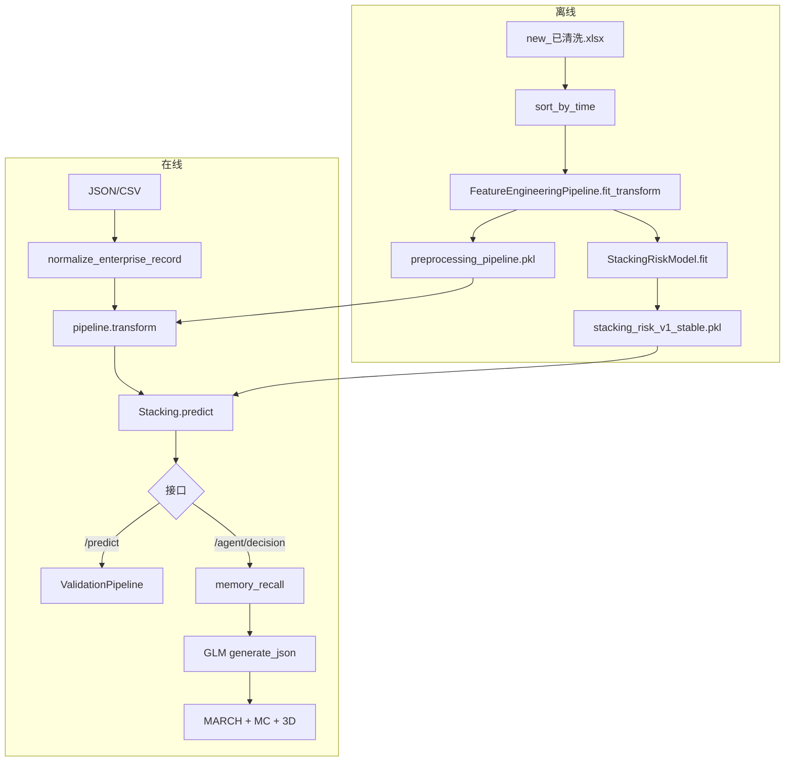

# 数据与模型流水线详解

本文档是 [README.md](../README.md) 中「数据与模型流水线」章节的**长文版**，面向需要理解实现细节、排障或扩展特征的研发人员。配置权威来源仍为根目录 `config.yaml`；数据目录约定见 [datasets/README.md](../datasets/README.md)。

---

## 目录

- [1. 系统总览](#1-系统总览)
- [2. 离线训练](#2-离线训练)
- [3. 特征工程与字段字典](#3-特征工程与字段字典)
- [4. API 输入标准化](#4-api-输入标准化)
- [5. 在线推理](#5-在线推理)
- [6. GLM 与 Harness 输出链路](#6-glm-与-harness-输出链路)
- [7. 产物、配置与环境变量](#7-产物配置与环境变量)
- [8. 源码索引与排障](#8-源码索引与排障)

---

## 1. 系统总览

本仓库将**数值风险等级预测**与**自然语言处置方案生成**解耦：

| 子系统 | 技术 | 输入 | 输出 |
|--------|------|------|------|
| 特征工程 | sklearn `Pipeline` + `ColumnTransformer` | 企业宽表一行（英文字段） | 数值特征矩阵 |
| 风险预测 | Stacking（7 基学习器 + 弹性网络元学习器） | 特征矩阵 | 蓝/黄/橙/红、四类概率、SHAP TopN |
| 记忆召回 | ChromaDB + BGE（可选） | SHAP Top3 拼 query | 历史案例片段 |
| 决策生成 | GLM（OpenAI 兼容 API） | Prompt + ML 结果 + 记忆 + 物理常识 | 政企处置 JSON |
| 风控校验 | MARCH / 蒙特卡洛 / 三维风险 | 决策 JSON + ML 结果 | `APPROVE` / `HUMAN_REVIEW` / `REJECT` |



**重要**：GLM **不参与**训练，**不决定** `predicted_level`；等级完全由本地 `StackingRiskModel` 给出。

---

## 2. 离线训练

### 2.1 入口与主流程

| 项 | 值 |
|----|-----|
| 命令 | `python scripts/train_model.py` |
| 实现 | `packages/mining_risk_train/src/mining_risk_train/train.py` → `train_and_save()` |
| 数据加载 | `DataLoader.load_merged_dataset()` → `config.data.merged_data_path` |

步骤（与代码一致）：

1. **加载**预合并宽表 `datasets/interim/merged/new_已清洗.xlsx`（约 80016 行 × 214 列）。
2. **时序排序**：优先 `report_time`（`config.features.special_features.time_col`），保证 train 段早于 test 段。
3. **标签处理**：列 `new_level`（A/B/C/D）→ 整数 0–3；无效标签行剔除；**目标列不进入** `FeatureEngineeringPipeline`。
4. **特征工程**：`FeatureEngineeringPipeline.fit_transform()`，并保存 `artifacts/pipelines/preprocessing_pipeline.pkl`。
5. **划分**：按时间顺序 70% / 20% / 10% → train / val / test（`config.model.stacking.split_ratio`）；训练时将 train+val 合并为 `X_train_full`。
6. **Stacking 训练**：`StackingRiskModel.fit(X_train_full, y_train_full)`；内部 5 折 `TimeSeriesSplit`（`shuffle: false`）生成 OOF 概率作为元特征。
7. **评估**：在 test 集上输出 accuracy / F1 / 混淆矩阵。
8. **保存**：`artifacts/models/stacking_risk_v1_stable.pkl`（stable 产物仅含树模型基学习器，避免 Keras 反序列化问题）。

### 2.2 标签与等级映射

| 训练标签 `new_level` | 模型内部类索引 | 对外等级名 `risk_levels` |
|----------------------|----------------|--------------------------|
| A | 0 | 蓝 |
| B | 1 | 黄 |
| C | 2 | 橙 |
| D | 3 | 红 |

实现见 `prepare_features()`：`label_map = {"A":0,"B":1,"C":2,"D":3}`；若列为数值则仅保留 0–3。

### 2.3 Stacking 结构

| 组件 | 说明 |
|------|------|
| 基学习器 | LR、XGBoost、LightGBM、CatBoost、RF（配置中另有 MLP、1D-CNN，stable 产物可能未包含） |
| OOF 元特征 | 每基学习器 4 类 `predict_proba` → 共 28 维（7×4） |
| 元学习器 | 弹性网络多项 LogisticRegression（`elastic_net_logistic`） |
| 推理输出 | `predicted_level`、`probability_distribution`、`shap_contributions`（依赖 shap 可选安装） |

### 2.4 备用数据路径（一般不用于日常训练）

`load_and_merge_data()` 从 `datasets/raw/public/` 多表尝试按 `报告历史ID`、`统一社会信用代码` 等键 left join。公开表 ID 体系常无交集，**可靠训练以预合并宽表为准**（见 `datasets/README.md` 与 `loader.py` 注释）。

### 2.5 模型迭代流水线（CI/CD）

与单次 `train_model.py` 不同，`mining_risk_train.iteration.pipeline` 可从 raw 监控触发、回归对比、漂移检测、审批与灰度。详见 README「模型迭代 CI/CD」；训练核心仍复用同一套特征与 Stacking。

---

## 3. 特征工程与字段字典

实现：`packages/mining_risk_common/src/mining_risk_common/dataplane/preprocessor.py`  
配置：`config.yaml` → `features`

Pipeline 结构：

```
MissingValueHandler → ColumnTransformer(多路变换器) → 合并为特征矩阵
```

仅当输入 DataFrame **实际存在**某列时，对应变换器才会加入（动态 `_build_pipeline`）。

### 3.1 主键列（不参与建模）

| 列名 | 含义 |
|------|------|
| `enterprise_id` | 企业标识 |
| `enterprise_name` | 企业名称 |
| `latest_risk_report_id` | 最近风险报告 ID |
| `Unnamed: 0` | 导出索引列 |

`ColumnTransformer` 使用 `remainder="drop"` 丢弃未显式列出的输入列。

### 3.2 二值列（`BinaryEncoder`）

| 列名 | 含义 | 缺失默认 |
|------|------|----------|
| `above_designated` | 是否规上企业 | 0 |
| `if_insure` | 是否投保 | 0 |
| `if_comply_formality` | 是否履行三同时 | 0 |
| `factory_in_factory` | 厂中厂 | 0 |
| `has_risk_item` | 有风险项 | 0 |
| `is_explosive_dust` | 爆炸性粉尘企业 | 0 |
| `is_ammonia_refrigerating` | 氨制冷企业 | 0 |
| `is_finite_space` | 有限空间企业 | 0 |
| `is_major_hazards` | 重大危险源 | 0 |
| `is_metal_smelter` | 金属冶炼企业 | 0 |
| `is_gas_company` | 燃气企业 | 0 |
| `confined_spaces_enterprise` | 有限空间作业企业 | 0 |
| `dangerous_chemical_enterprise` | 危化品企业 | 0 |
| `risk_accident_flag` | 曾发生事故 | 0 |
| `risk_company_flag` | 风险重点企业 | 0 |
| `risk_company_key_flag` | 关键风险企业 | 0 |
| `if_valid` | 数据有效标识 | 0 |

编码规则：是/有/1/true 等 → 1；否/无/0 → 0；无法解析 → 0（按低风险处理）。

> 注：`if_certificate`、`safety_invest` 在训练集中 100% 缺失，已从 `config.yaml` 注释掉，不纳入特征。

### 3.3 数值列（`NumericTransformer`）

处理链：**99 分位截断** → **列均值填缺失** → **`log1p`** → **`MinMaxScaler`**。

| 列名 | 含义 |
|------|------|
| `staff_num` | 企业职工总人数 |
| `safety_num` | 安全管理人员数量 |
| `fulltime_safety_num` | 专职安全管理人员数 |
| `parttime_safety_num` | 兼职安全管理人员数 |
| `safety_dept_num` | 部门安全管理人员数量 |
| `fulltime_cert_num` | 专职安全管理人持证员数 |
| `parttime_cert_num` | 兼职安全管理人持证员数 |
| `special_work_cert_num` | 特种作业持证人数 |
| `last_year_income` | 上一年经营收入 |
| `fixed_assets` | 固定资产 |
| `insure_money` | 投保金额 |
| `injury_insurance` | 工伤保险支出（万元） |
| `insure_num` | 投保人数 |
| `last_year_turnover` | 上一年人员流动率 |
| `risk_total_count` | 总风险数 |
| `risk_level_a_count` | A 级风险数 |
| `risk_level_b_count` | B 级风险数 |
| `risk_level_c_count` | C 级风险数 |
| `risk_level_d_count` | D 级风险数 |
| `risk_with_accident_count` | 曾发事故的风险数 |
| `check_total_count` | 检查总次数 |
| `check_trouble_count` | 检查发现问题次数 |
| `trouble_total_count` | 隐患总数 |
| `trouble_level_1_count` | 一般隐患数 |
| `trouble_level_2_count` | 重大隐患数 |
| `trouble_unrectified_count` | 未整改隐患数 |
| `writ_total_count` | 文书总数 |
| `writ_from_case_count` | 立案文书数 |
| `writ_from_check_count` | 检查文书数 |
| `total_penalty_money` | 处罚金额 |
| `dust_ganshi_num` | 干式除尘系统数量 |
| `dust_shishi_num` | 湿式除尘系统数量 |
| `gaolu_num` | 高炉数量 |
| `zhuanlu_num` | 转炉数量 |
| `dianlu_num` | 电炉数量 |
| `dust_clear_count` | 除尘作业次数 |

### 3.4 枚举列（`EnumRiskMapper`）

| 列名 | 含义 | 未知值 |
|------|------|--------|
| `supervision_large` | 行业监管大类 | 0.5 |
| `safety_build` | 安全生产标准化建设情况 | 0.5 |
| `rh_production_status` | 生产状态 | 0.5 |
| `business_status` | 经营状态 | 0.5 |

按业务有序映射到 [0, 1] 区间（具体映射表见 `EnumRiskMapper` 实现）。

### 3.5 行业列（`IndustryRiskCoefficient`）

| 列名 | 含义 |
|------|------|
| `indus_type_class` | 国民经济门类 |
| `indus_type_large` | 国民经济大类 |
| `indus_type_middle` | 国民经济中类 |
| `indus_type_small` | 国民经济小类 |
| `supervision_large` | 行业监管大类（与枚举重叠输入） |

输出派生特征：`industry_risk_coefficient`（关键词匹配，如采矿/危化 1.5 等，见 `config.model.industry_risk_coefficients`）。

### 3.6 文本列

`config.features.text_columns` 当前为 **空数组**。预合并宽表已将文本聚合为数值；若未来启用，会输出 `{col}_completeness` 与 `{col}_risk_words`。

### 3.7 缺失值前置策略（`MissingValueHandler`）

在 `ColumnTransformer` 之前执行：

| 策略 | 字段 | 填充 |
|------|------|------|
| `high_score`（管理类） | `safety_build`, `if_comply_formality` | 0.7（偏高风险） |
| `mean_imputation`（客观类） | `last_year_turnover`, `last_year_income` | 训练集均值 |

### 3.8 特殊逻辑派生特征

| 变换器 | 输入列 | 输出特征 | 逻辑摘要 |
|--------|--------|----------|----------|
| `DustRemovalRatioTransformer` | `dust_ganshi_num`, `dust_shishi_num` | `dry_removal_ratio`, `wet_removal_ratio` | 干/湿除尘占比 |
| `ConfinedSpaceORTransformer` | `is_finite_space`, `confined_spaces_enterprise`, `risk_finite_key_flag` | `confined_space_flag` | 任一为真则 1 |
| `HazardousChemicalORTransformer` | `dangerous_chemical_enterprise`, `is_ammonia_refrigerating`, `risk_whp_flag`, `risk_whp_use_flag` | `hazardous_chemical_flag` | 任一为真则 1 |
| `TimeDecayWeightTransformer` | `report_time` + `trouble_total_count`, `risk_total_count`, `check_total_count` | `{col}_decay_weighted` | 当年 1.0 / 去年 0.7 / 更早 0.5；`report_time` 缺失权重 1.0 |
| `GeoFenceTransformer` | `dir_longitude`, `dir_latitude` | `in_chemical_park` | 点是否在园区多边形内（无 polygon 配置时为 0） |
| `EnterpriseAggregator` | `enterprise_id` + 隐患/文书列 | `enterprise_hazard_score`, `enterprise_doc_score` | 立案权重 3.0 > 检查 1.0 |
| `DataCredibilityTransformer` | `cf_source` 或 `数据来源` | `data_credibility` | 执法 4 > 复查 3 > 日常 2 > 自报 1 |

### 3.9 变换后特征名列表

`FeatureEngineeringPipeline._get_feature_names()` 与 `_build_pipeline()` 镜像，典型输出包括：

- 全部存在的二值、数值、枚举列（经变换后的同名或缩放列）
- `industry_risk_coefficient`
- `dry_removal_ratio`, `wet_removal_ratio`
- `confined_space_flag`, `hazardous_chemical_flag`
- `trouble_total_count_decay_weighted` 等
- `in_chemical_park`
- `enterprise_hazard_score`, `enterprise_doc_score`
- `data_credibility`

**推理时**必须使用与训练时**同一份** `preprocessing_pipeline.pkl`，否则特征维度与 Stacking 输入不一致会报错。

---

## 4. API 输入标准化

实现：`packages/mining_risk_common/src/mining_risk_common/dataplane/field_normalizer.py`

在 `pipeline.transform()` 之前，所有 API / 演示 CSV 行都经过 `normalize_enterprise_record()`：

```
原始 dict → 补 enterprise_id → FIELD_ALIASES 中英映射 → SCENARIO_DEFAULTS
         → _derive_demo_fields → 补齐 required_feature_columns 缺列
```

### 4.1 中英字段别名（节选）

完整表见源码 `FIELD_ALIASES`。常用映射：

| 英文字段 | 中文别名（部分） |
|----------|------------------|
| `enterprise_id` | 企业ID、统一社会信用代码 |
| `enterprise_name` | 企业名称 |
| `risk_accident_flag` | 是否发生事故 |
| `has_risk_item` | 是否发现问题隐患 |
| `safety_build` | 安全生产标准化建设情况 |
| `dust_shishi_num` | 湿式除尘系统数量、湿式除尘器数量 |
| `report_time` | 报告时间、上报时间 |
| `cf_source` | 数据来源、来源 |

英文字段若已有值，**优先于**中文别名。

### 4.2 场景默认值 `SCENARIO_DEFAULTS`

| 场景 ID | 自动填充示例 |
|---------|----------------|
| `chemical` | `supervision_large=危险化学品`, `dangerous_chemical_enterprise=1`, `risk_whp_flag=1` |
| `metallurgy` | `supervision_large=冶金`, `is_metal_smelter=1` |
| `dust` | `supervision_large=粉尘涉爆`, `is_explosive_dust=1` |

### 4.3 演示字段派生 `_derive_demo_fields`

前端/演示 CSV 中部分列不在训练配置里，会**保守派生**为训练列，例如：

| 演示列 | 派生到 |
|--------|--------|
| `风险等级` | `risk_total_count`, `risk_level_*_count` |
| `是否发现问题隐患` | `trouble_total_count`, `check_trouble_count` |
| `重大危险源数量` | `is_major_hazards` |
| `危化品储罐数量` | `dangerous_chemical_enterprise` |
| `高炉容积_m3` | `gaolu_num`, `is_metal_smelter` |
| `湿式除尘器数量` | `dust_shishi_num` |

### 4.4 缺列填充规则

`required_feature_columns()` 汇总 `config.features` 全部输入列（含 `special_features` 引用列与 `cf_source`）。

| 类型 | 默认值 |
|------|--------|
| 二值 / 数值 | `0` |
| 枚举 / 行业字符串 | `"未知"` |
| `report_time` | 当天日期 |
| `cf_source` | `"API输入"` |

返回 `NormalizationReport`（`mapped_fields`, `defaulted_fields`）便于日志审计。

### 4.5 演示 CSV 未纳入训练的列

`datasets/demo/csv/mock_enterprises_dust.csv` 等文件中的列，若**不在** `config.yaml` 的 `features` 中，标准化后仍不会进入 Stacking，例如：

- `管理类别`、`预测风险等级`、`具体风险描述`、`管控措施`
- `抛光工位数量`、`粉尘清扫制度执行率`、`防爆电气覆盖率`、`静电接地完好率`

这些列主要用于前端展示或未来扩展，当前模型不使用。

---

## 5. 在线推理

### 5.1 路径 A：纯预测 `POST /api/v1/predict`

| 步骤 | 模块 |
|------|------|
| 1 | `PredictionService.predict()` |
| 2 | `normalize_enterprise_record(request.data)` |
| 3 | `pipeline.transform(DataFrame[1 row])` |
| 4 | `StackingRiskModel.predict(features)` |
| 5 | `ValidationPipeline.run()`（规则校验，非 LLM） |
| 6 | 按等级附加模板化 `government_advice` / `enterprise_advice` |

**不调用 GLM。**

### 5.2 路径 B：完整决策 `POST /api/v1/agent/decision`

LangGraph 工作流（`mining_risk_serve/agent/workflow.py`）：

| 节点 | 作用 |
|------|------|
| `data_ingestion` | normalize + `pipeline.transform` → `state["features"]` |
| `risk_assessment` | Stacking → `state["prediction"]` |
| `memory_recall` | SHAP Top3 → query → `HybridMemoryManager.recall_long_term`（RAG 关闭则跳过） |
| `decision_generation` | Prompt + GLM + MARCH 回环 + 蒙特卡洛 + 三维风险 → `final_status` |
| `result_push` | 补齐响应结构、可选写入 `var/decisions/` |

流式接口：`POST /api/v1/agent/decision/stream` 以 SSE 推送各节点状态。

### 5.3 Mock 降级

当 `MRA_ENABLE_MOCK_FALLBACK=true` 且模型/LLM 不可用时，`mining_risk_common.demo.data.generate_mock_decision()` 返回完整演示 JSON（`mock=true`）。生产环境建议 `MRA_ENABLE_MOCK_FALLBACK=false`。

---

## 6. GLM 与 Harness 输出链路

### 6.1 GLM 客户端

| 项 | 值 |
|----|-----|
| 实现 | `packages/mining_risk_serve/src/mining_risk_serve/llm/glm5_client.py` |
| 类名 | `OpenAICompatibleClient`（别名 `GLM5Client`） |
| 默认端点 | `https://open.bigmodel.cn/api/paas/v4/` |
| 默认模型 | `glm-5.1`（`config.yaml`）；代码 fallback `glm-5` |
| 密钥 | 环境变量 `GLM5_API_KEY`（`api_key_env`） |
| 调用方法 | `generate_json(prompt, temperature, max_tokens)`，`response_format: json_object` |

可通过 `LLM_PROVIDER` 切换到 `deepseek` 等其他 OpenAI 兼容 provider（见 `config.yaml` → `llm.providers`）。

### 6.2 Prompt 构成

模板路径（按场景）：

- `prompts/decision_v1_chemical.txt`
- `prompts/decision_v1_metallurgy.txt`
- `prompts/decision_v1_dust.txt`

Jinja2 变量：

| 变量 | 来源 |
|------|------|
| `enterprise_id` | 请求 |
| `predicted_level` | Stacking |
| `probability_distribution` | Stacking JSON |
| `shap_contributions` | Stacking JSON |
| `memory_context` | RAG 召回（最多 5 条，每条截断约 300 字） |
| `physics_context` | 场景知识库 `工业物理常识及传感器时间序列逻辑.md` 前 2000 字 |

### 6.3 GLM 期望输出的 JSON 结构

```json
{
  "risk_level_and_attribution": { },
  "government_intervention": {
    "lead_department": "",
    "coordinating_departments": [],
    "measures": [],
    "deadline": ""
  },
  "enterprise_control": {
    "equipment_actions": [],
    "operational_actions": [],
    "parameter_adjustments": [],
    "emergency_resources": [],
    "personnel_actions": []
  }
}
```

实际字段名以 Prompt 模板为准；解析失败会触发重试。

### 6.4 MARCH 回环

1. `Proposer.decompose()` 将决策拆为原子命题。
2. `run_march_validation()`：合规 → 工况逻辑 → 处置可行性。
3. 未通过：将 `march_reason` 追加为「修正反馈」，**再次** `generate_json()`，最多 **3** 次。
4. 最终仍失败 → `final_status = REJECT`，不再依赖 GLM 救场。

### 6.5 蒙特卡洛与三维风险

| 校验 | 参数 | 未通过时 |
|------|------|----------|
| 蒙特卡洛 | 20 次采样；阈值 chemical **0.90**，metallurgy/dust **0.85** | `HUMAN_REVIEW` |
| 三维风险 | 加权分阈值 chemical **2.2**，metallurgy/dust **2.5** | `HUMAN_REVIEW` |
| 全部通过 | — | `APPROVE` |

### 6.6 职责边界（再次强调）

```
Stacking → 等级 + 概率 + SHAP     （确定性 ML）
GLM      → 政企处置文案 JSON       （生成式 LLM）
Harness  → 安全与置信度闸门         （规则 + 采样）
```

---

## 7. 产物、配置与环境变量

### 7.1 训练/推理产物

| 路径 | 说明 |
|------|------|
| `artifacts/pipelines/preprocessing_pipeline.pkl` | 拟合后的 `FeatureEngineeringPipeline` |
| `artifacts/models/stacking_risk_v1_stable.pkl` | 拟合后的 Stacking 模型 |
| `var/chroma/` | RAG 向量库（运行时） |
| `var/decisions/` | 决策 JSON 落盘（可配置 `MINING_DECISION_OUTPUT_DIR`） |

### 7.2 关键配置项

| 配置路径 | 含义 |
|----------|------|
| `data.merged_data_path` | 训练宽表 |
| `features.*` | 全部特征列与特殊逻辑 |
| `model.stacking.*` | 基学习器、CV、划分比例、产物路径 |
| `model.risk_levels` | 蓝黄橙红 |
| `llm.provider` / `llm.providers.*` | LLM 端点 |
| `scenarios.*` | 场景 Prompt、阈值、知识库子目录 |
| `harness.memory.long_term.rag.enabled` | 是否启用 RAG 召回 |

### 7.3 环境变量（节选）

| 变量 | 用途 |
|------|------|
| `MINING_PROJECT_ROOT` | 项目根目录（测试/脚本） |
| `GLM5_API_KEY` | 智谱 API 密钥 |
| `LLM_PROVIDER` | 覆盖 `llm.provider` |
| `LLM_GLM5_MODEL` / `LLM_GLM5_BASE_URL` | 覆盖模型与端点 |
| `MRA_ENABLE_MOCK_FALLBACK` | Mock 降级开关 |
| `RAG_EMBEDDING_BACKEND` | RAG 嵌入后端（须与 rebuild 一致） |

完整列表见 `.env.example`。

---

## 8. 源码索引与排障

### 8.1 文件索引

| 主题 | 路径 |
|------|------|
| 训练入口 | `scripts/train_model.py` |
| 训练逻辑 | `packages/mining_risk_train/src/mining_risk_train/train.py` |
| 数据加载 | `packages/mining_risk_common/src/mining_risk_common/dataplane/loader.py` |
| 特征工程 | `packages/mining_risk_common/src/mining_risk_common/dataplane/preprocessor.py` |
| 字段标准化 | `packages/mining_risk_common/src/mining_risk_common/dataplane/field_normalizer.py` |
| Stacking | `packages/mining_risk_common/src/mining_risk_common/model/stacking.py` |
| 预测服务 | `packages/mining_risk_serve/src/mining_risk_serve/api/services/prediction_service.py` |
| 资源加载 | `packages/mining_risk_serve/src/mining_risk_serve/api/services/dependencies.py` |
| 决策工作流 | `packages/mining_risk_serve/src/mining_risk_serve/agent/workflow.py` |
| GLM 客户端 | `packages/mining_risk_serve/src/mining_risk_serve/llm/glm5_client.py` |
| 配置 | `config.yaml` |
| 预处理回归测试 | `tests/test_train_preprocess_regression.py` |
| 字段标准化测试 | `tests/test_field_normalizer.py` |

### 8.2 常见问题

| 现象 | 可能原因 | 处理 |
|------|----------|------|
| 特征维度不匹配 | pipeline 与 model 不是同次训练产物 | 重新 `train_model.py` 或配对拷贝 artifacts |
| 预测全为默认/Mock | 未加载 pkl 或 `MRA_ENABLE_MOCK_FALLBACK=true` | 检查 artifacts 路径与 env |
| GLM 超时/401 | `GLM5_API_KEY` 未配置 | 配置 `.env` 或启用 Mock |
| RAG 维度错误 | rebuild 与运行时嵌入后端不一致 | `rebuild_rag_index.py --clear` 并统一 `RAG_EMBEDDING_BACKEND` |
| 中文 CSV 列无效 | 列名未在 `FIELD_ALIASES` 且非训练列 | 扩展 `field_normalizer` 或 `config.features` |

### 8.3 扩展新特征的检查清单

1. 在 `config.yaml` → `features` 增加列名（二值/数值/枚举/或 `special_features`）。
2. 若有中文 API 字段，在 `FIELD_ALIASES` 增加映射。
3. **重新训练**并替换 `preprocessing_pipeline.pkl` 与 stacking pkl。
4. 运行 `tests/test_train_preprocess_regression.py` 与 `tests/test_field_normalizer.py`。
5. 若影响决策语义，同步更新对应场景 `prompts/decision_v1_*.txt`。

---

*文档版本与代码同步至仓库当前 `config.yaml`；列注释以配置文件内中文说明为准。*
